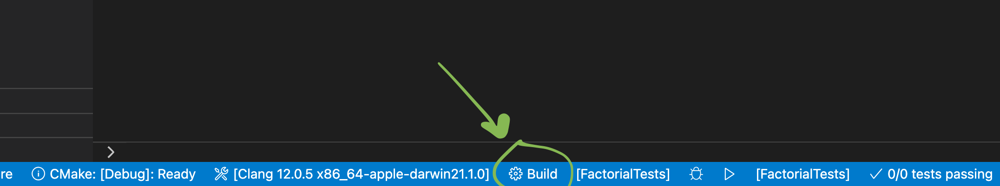
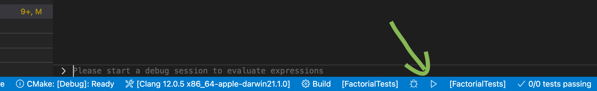

# Unit Test in C++

There are many frameworks to performs unit test in C++, we will present the most popular ones and show how to use them.
The testing framework used here are `Catch`, `Google Test` and `Boost Test`

## Code to test

We well test a simple factorial function using different frameworks.
The code is as follow

```c++
// factorial.cpp
#include "factorial.hpp"

int Factorial( int number ) {
    return number <= 1 ? number : Factorial(number-1)*number;
}
```

```c++
// factorial.hpp
#ifndef FACTORIAL_HPP
#define FACTORIAL_HPP

int Factorial( int number );
#endif /* FACTORIAL_HPP */
```

## Catch

It is a testing framework created by Phil Nash. This unit-test framework is very straightforward. It is header only and easy to setup.
**PS**: the header only frame-work used here is Catch v1.

### Setup

- Download catch header from [here](https://github.com/philsquared/Catch/releases/download/v1.12.2/catch.hpp).
- Put the header files anywhere reachable from your project. you can put it in the project parent folder or in a directory in the header search path to find.

#### Define Test

To test this function, we have to tell Catch to provide a main() function, which is the test binary's entry point.

```c++
// tests-main.cpp
#define CATCH_CONFIG_MAIN
#include "catch.hpp"
```

then you can write test using the `TEST_CASE` macro. it takes a text explaining what the test does. Then you can write test in form of assertions. `Catch` provides various macros to test assertion, such as REQUIRE, CHECK, REQUIRE_FALSE, CHECK_FALSE.

```c++
// tests-factorial.cpp
#include "catch.hpp"
#include "factorial.cpp"

TEST_CASE( "Factorials for zero", "[factorial]" ) {
    REQUIRE( Factorial(0) == 1 );
}

TEST_CASE( "Factorials for positive numbers", "[factorial]" ) {
    REQUIRE( Factorial(1) == 1 );
    REQUIRE( Factorial(2) == 2 );
    REQUIRE( Factorial(3) == 6 );
    REQUIRE( Factorial(10) == 3628800 );
}
```

#### Running Test

To run the tests, first we compile `catch-tests-main.cpp` to provide us with the compiled catch header file and with the entry point.

```bash
g++ -std=c++17 -stdlib=libc++  test/catch-tests-main.cpp -o tests-main.o -c
```

then we run the tests with:

```bash
g++ -std=c++17 -stdlib=libc++  tests-main.o test/catch-tests-factorial.cpp -o tests && ./tests
```

when executing the file, we get the following output:

```bash
~~~~~~~~~~~~~~~~~~~~~~~~~~~~~~~~~~~~~~~~~~~~~~~~~~~~~~~~~~~~~~~~~~~~~~~~~~~~~~~
tests is a Catch v2.13.6 host application.
Run with -? for options

-------------------------------------------------------------------------------
Factorials for zero
-------------------------------------------------------------------------------
tests-factorial.cpp:5
...............................................................................

tests-factorial.cpp:6: FAILED:
  REQUIRE( Factorial(0) == 1 )
with expansion:
  0 == 1

===============================================================================
test cases: 2 | 1 passed | 1 failed
assertions: 5 | 4 passed | 1 failed
```

it tells us that TEST_CASE `Factorials for zero` failed and that the reason is the assertion `REQUIRE( Factorial(0) == 1 )`
to learn more, see [here](https://github.com/catchorg/Catch2/tree/Catch1.x)

## Google Test

Google Test is Google's C++ Testing and Mocking framework. it is a production grade framework, very fast with rich set of assertions. It also provides value and type parameterized tests, XML test report and more.

### setup

Google Test is not a header-only library, it must be compiled into a set of libraries and linked to the project test.

1. clone [GoogleTest](https://github.com/google/googletest/) repository

2. Create a `CMakeLists.txt` in which you specify the program you want to test and the path to googletest installation and path to the tests folder. see [example](CMakeLists.txt).

3. In the test folder, create the test code and a `CMakeLists.txt` file in which you specify the Source file you want to test and you link it with gtest library.

4. you run the cmake command.

```bash
cmake --build build --config Debug --target FactorialTests -j 10 --
```

In vscode, you can click on `build` as shown bellow
.
make sure [Cmake](https://marketplace.visualstudio.com/items?itemName=twxs.cmake) and [CMake Tools](https://marketplace.visualstudio.com/items?itemName=ms-vscode.cmake-tools) extensions are installed

1. Execute the test by running the generated file in the build directory. In our case `FactorialTests`

```bash
./build/test/FactorialTests
```

In vscode, you can click on the `play` button as shown bellow. The test name is also displayed.


#### Writing Tests

we will test the same factorial function.
the implementation is in [Factorial.cpp](Factorial.cpp), the header is in [Factorial.hpp] and the test is in [test/FactorialTests](test/FactorialTests.cpp)

#### Define an Entry Point

Google Test will supply as main() function when we link gtest_main to the project unit-test.
this linking is done in the `CMakeLists.txt` file using `target_link_libraries` cmake command.

#### Writing Test Cases

To create a test, we import the `gtest/gtest.h` header and we use the `TEST` macro to group our tests. `TEST` macro takes the *test_case_name* and the *test_name* as parameter. Google Test also provide other macros like `TEST_F` to access objects and subroutines, and `TEST_P` to write tests with parameters.
GoogleTest provides many assertion macros that we can use, like ASSERT_TRUE, ASSERT_FALSE, ASSERT_EQ, ASSERT_LT, ASSERT_THROM, etc.

#### Test Output

After building and running the `factorial` tests, we get the following output

```bash
Running main() from /Users/ymektoubi/Documents/project/practice/cpp/googletest/googletest/src/gtest_main.cc
[==========] Running 2 tests from 1 test suite.
[----------] Global test environment set-up.
[----------] 2 tests from FactorialTests
[ RUN      ] FactorialTests.HandlesZeroInput
/Users/ymektoubi/Documents/project/practice/cpp/Unit-Test-in-Cpp/test/FactorialTests.cpp:23: Failure
Expected equality of these values:
  Factorial(getX())
    Which is: 0
  1
[  FAILED  ] FactorialTests.HandlesZeroInput (0 ms)
[ RUN      ] FactorialTests.HandlesPositiveInput
[       OK ] FactorialTests.HandlesPositiveInput (0 ms)
[----------] 2 tests from FactorialTests (0 ms total)

[----------] Global test environment tear-down
[==========] 2 tests from 1 test suite ran. (0 ms total)
[  PASSED  ] 1 test.
[  FAILED  ] 1 test, listed below:
[  FAILED  ] FactorialTests.HandlesZeroInput

 1 FAILED TEST
```

it tells us the total number to test cases, the number of failed tests, the number of succeeded test and the failed assertion.

### Boost Test

Boost Test is a unit-testing framework that is part of the Boost C++ libraries.
Boost Test supports three different usage variants

- a header-only variant like catch
use this to avoid compilation of standalone library. you only need to include one header and define the `BOOST_TEST_MODULE` at the start of the file as follow:

```c++
#define BOOST_TEST_MODULE test module name
#include <boost/test/included/unit_test.hpp>
```

compile the test and run it.

```bash
$ g++ test/boost-header-test-factorial.cpp -o boost-header-test-factorial.o
$ ./boost-header-test-factorial.o
```

- a static library variant like Google Test
To use it, you need two steps:

1. include the following line in all translation units in the test module

  ```c++
  #include <boost/test/unit_test.hpp>
  ```

  and one and only one translation unit should include the following lines:

  ```c++
  #define BOOST_TEST_MODULE test module name
  #include <boost/test/unit_test.hpp>
  ```

2. link with the Unit Test Framework static library

  ```bash
  $ g++ test/boost-static-tests-factorial.cpp /usr/local/lib/libboost_unit_test_framework.a -o boost-static-tests-factorial.o
  $ ./boost-static-tests-factorial.o
  ```

- a shared library which is linked at runtime.
In the project with large number of test modules the static library variant of the Unit Test Framework may cause you to waste a lot of disk space. The solution is to link test module dynamically with the Unit Test Framework built as a shared library. to do that

1. add the following lines to all translation units in a test module:

  ```c++
  #define BOOST_TEST_DYN_LINK
  #include <boost/test/unit_test.hpp>
  ```
  
  and one and only one translation unit should include the following lines:

  ```c++
  #define BOOST_TEST_MODULE test module name
  #define BOOST_TEST_DYN_LINK
  #include <boost/test/unit_test.hpp>
  ```

2. link with the Unit Test Framework shared library

  ```bash
  $ g++ -std=c++17 -stdlib=libc++ tests-factorial_boost_shared.cpp /usr/local/lib/libboost_unit_test_framework.so -o tests-factorial_boost_shared.o
  ```

**PS**: to use boost test with static or shared library, you have to build the unit test framework.

```bash
cd $boost_path
> ./bootstrap.sh
> ./b2 --with-test --prefix=$boost_installation_prefix install
```

## References
- [C++ Crash Course](https://ccc.codes/): Josh Lospinoso
- [GoogleTest](https://github.com/google/googletest)
- [Catch v1](https://github.com/catchorg/Catch2/tree/Catch1.x)
- [Boost test]()